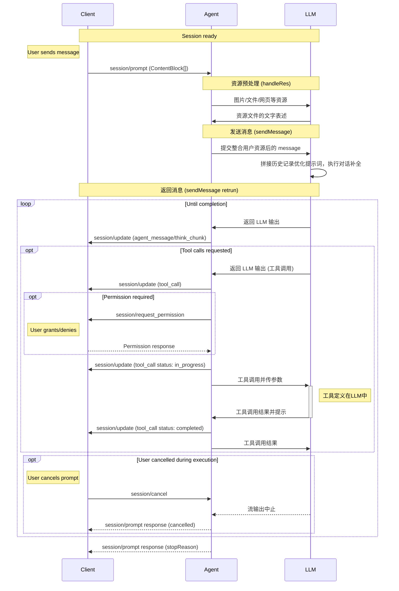

# note-agent

## 流程

```mermaid  theme={null}
sequenceDiagram
    participant Client
    participant Agent
    participant LLM

    Note over Client,LLM: Session ready

    Note left of Client: User sends message
    Client->>Agent: session/prompt (ContentBlock[])
    
    Note over Agent,LLM: 资源预处理 (handleRes)
    Agent->>LLM: 图片/文件/网页等资源
    LLM->>Agent: 资源文件的文字表述
    
    Note over Agent,LLM: 发送消息 (sendMessage)
    Agent->>LLM: 提交整合用户资源后的 message
    LLM->>LLM: 拼接历史记录优化提示词，执行对话补全

    Note over Client,LLM: 返回消息 (sendMessage retrun)
    loop Until completion
        LLM->>Agent: 返回 LLM 输出
        Agent->>Client: session/update (agent_message/think_chunk)

        opt Tool calls requested
            LLM->>Agent: 返回 LLM 输出 (工具调用)
            Agent->>Client: session/update (tool_call)
            opt Permission required
                Agent->>Client: session/request_permission
                Note left of Client: User grants/denies
                Client-->>Agent: Permission response
            end
            Agent->>Client: session/update (tool_call status: in_progress)
            Agent->>+LLM: 工具调用并传参数
            Note right of LLM: 工具定义在LLM中
            LLM->>-Agent: 工具调用结果并提示
            Agent->>Client: session/update (tool_call status: completed)
            Agent->>LLM: 工具调用结果
        end

        opt User cancelled during execution
            Note left of Client: User cancels prompt
            Client->>Agent: session/cancel
            LLM-->>Agent: 流输出中止 
            Agent-->>Client: session/prompt response (cancelled)
        end
    end

    Agent-->>Client: session/prompt response (stopReason)

```
